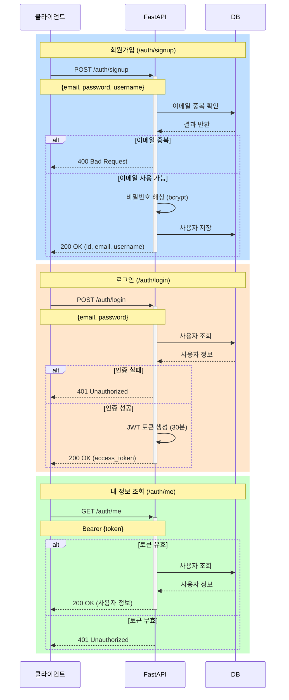
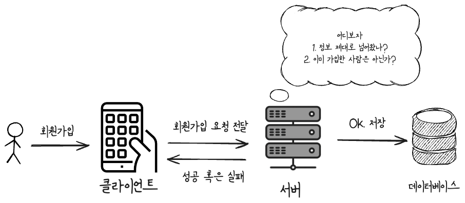
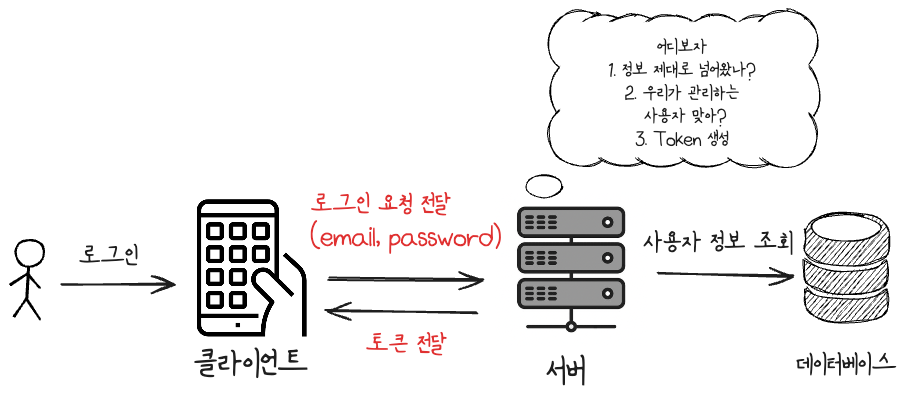
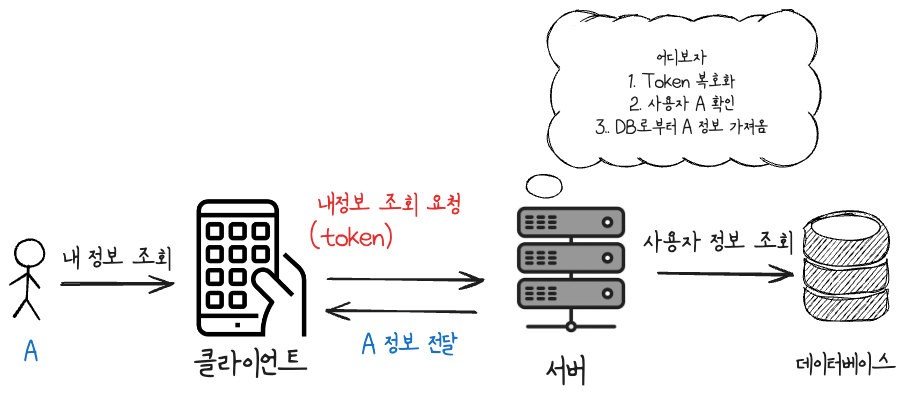

# FastAPI에서 JWT로 사용자 회원가입/로그인 구현하기

오늘은 FastAPI에서 회원가입과 로그인 기능을 구현해보려합니다. 대부분의 프로젝트에서 필요한 기능임에도 실제로 구현해 본 경험이 없어 이번 기회에 구현해보았습니다. 피드백 주시면 감사드리겠습니다.

코드는 [https://github.com/Ssuwani/fastapi-jwt](https://github.com/Ssuwani/fastapi-jwt) 에서 확인할 수 있습니다.


## 아젠다

1. 구현할 내용 Sequence Diagram으로 이해하기
2. 회원가입 구현하기
3. 로그인 구현하기
4. 내 정보 조회 구현하기

## 1. 구현할 내용 Sequence Diagram으로 이해하기

먼저 그림으로 간단히 오늘 구현할 내용을 나타내 보았습니다. \
조금 복잡해 보일 수 있지만 클라이언트로부터 회원가입, 로그인, 내 정보 조회 요청이 들어왔을 때의 동작이고 따라가다보면 어렵지 않게 따라갈 수 있을 것입니다.



## 2. 회원가입 구현하기

회원이라는 건 모든 서비스에 필요한 것은 아닙니다. 하지만, 사용자별로 맞춤형 서비스를 제공하고 관리하기 위해서는 "회원"을 관리할 수 있어야 합니다. 

또, 서비스에서는 관리의 관점에서 사용자 별로 서로 다른 권한을 부여할 수 있어야 합니다. 특정 사용자는 다른 사용자의 개인 정보를 조회할 수 있어선 안됩니다. 

지금부터 구현할 FastAPI 서버는 사용자 요청으로부터 회원가입 혹은 로그인 요청을 받게 됩니다. 그러면 서버는 이를 검증하고 중복 여부를 확인하고 문제가 없다면 데이터베이스에 저장합니다. 



코드로 구현하면 아래와 같습니다. (그림에서 로직 일부는 생략되어 있습니다.)

```python
@router.post("/signup", response_model=UserResponse)
async def signup(user: UserCreate, db: Session = Depends(get_db)):
    # 이메일 중복 확인
    db_user = db.query(User).filter(User.email == user.email).first()
    if db_user:
        raise HTTPException(
            status_code=status.HTTP_400_BAD_REQUEST, 
            detail="Email already registered"
        )

    # 비밀번호 해싱 및 사용자 생성
    hashed_password = get_password_hash(user.password)
    db_user = User(
        email=user.email,
        username=user.username,
        hashed_password=hashed_password
    )
    # 데이터베이스에 저장
    db.add(db_user)
    db.commit()
    return db_user
```

<br/>

## 3. 로그인 구현하기

로그인이라는 과정은 회원별로 서로 다른 정보를 제공하기 위한 과정입니다. A 사용자에게 B 사용자의 정보를 제공해선 안됩니다. 그리고 어떤 데이터를 조회할 때마다 매번 사용자 인증을 할 순 없습니다. 

로그인은 일반적으로 사용자 이메일, 패스워드를 통해 인증을 진행합니다. 클라이언트가 서버에 요청을 보낼때마다 이메일, 패스워드를 전달해준다면 서버 입장에선 좋겠지만 보안상 안전하지 않습니다. 

따라서, 한번의 로그인 과정을 거치면 서버는 특정 시간 동안 유효한 **토큰**을 클라이언트에게 발급해줍니다. 그리고 이 토큰을 가지고 서버에 요청을 보내면 서버는 토큰을 검증하고 요청을 처리합니다. 

또 이게 가능한 이유는 토큰은 사용자 정보를 암호화한 정보입니다. 서버만이 이를 복호화할 수 있기 때문입니다. 




코드로 구현하면 아래와 같습니다. (그림에서 로직 일부는 생략되어 있습니다.)

```python
ACCESS_TOKEN_EXPIRE_MINUTES = 30  # 토큰 유효 시간

@router.post("/login", response_model=Token)
async def login(user_credentials: UserLogin, db: Session = Depends(get_db)):
    # 사용자 확인
    user = db.query(User).filter(User.email == user_credentials.email).first()
    if not user or not verify_password(user_credentials.password, user.hashed_password):
        raise HTTPException(
            status_code=status.HTTP_401_UNAUTHORIZED,
            detail="Incorrect email or password"
        )

    # 토큰 생성
    access_token = create_access_token(
        data={"sub": user.email},
        expires_delta=timedelta(minutes=ACCESS_TOKEN_EXPIRE_MINUTES)
    )
    return {"access_token": access_token, "token_type": "bearer"}
```

추가로 create_access_token 함수는 토큰을 생성하는 함수입니다. 데이터를 입력받아 expire 시간을 설정하고 토큰을 반환합니다. 

토큰은 데이터를 암호화한 하나의 string에 불과합니다. 암호화할 때 사용되는 SECRET_KEY가 노출된다면 누구든 토큰을 통해 복호화할 수 있기에 노출되어선 안됩니다.

```python
SECRET_KEY = "SECRET_KEY" # 노출되어선 안됩니다!! (환경변수로 관리)

def create_access_token(
    data: dict, expires_delta: Optional[timedelta] = timedelta(minutes=15)
):
    to_encode = data.copy()
    expire = datetime.now(tz=UTC) + expires_delta

    to_encode.update({"exp": expire})
    encoded_jwt = jwt.encode(to_encode, SECRET_KEY, algorithm=ALGORITHM)
    return encoded_jwt
```

<br/>

## 4. 내 정보 조회 구현하기

너무 당연하지만,, A가 내 정보 조회 요청 시 A 정보가 반환되어야 합니다. 단, 또 다시 로그인을 요구하면 안됩니다. 앞서 서버로부터 받은 토큰으로 요청을 보내면 서버는 토큰을 검증하고 요청을 처리합니다. 



코드로 구현하면 아래와 같습니다. 

라우터: 
```python
@router.get("/me", response_model=UserResponse)
async def get_user_me(current_user: Annotated[User, Depends(get_current_user)]):
    return current_user
```

토큰 검증 및 사용자 조회:
```python
async def get_current_user(
    token: str = Depends(oauth2_scheme),  # Header에 포함된 토큰
    db: Session = Depends(get_db),
) -> User:
    credentials_exception = HTTPException(
        status_code=status.HTTP_401_UNAUTHORIZED,
        detail="인증 정보를 확인할 수 없습니다",
        headers={"WWW-Authenticate": "Bearer"},
    )
    try:
        payload = jwt.decode(token, SECRET_KEY, algorithms=[ALGORITHM])
        email: str = payload.get("sub")
    except JWTError:
        raise credentials_exception

    # DB로부터 사용자 조회
    user = db.query(User).filter(User.email == email).first()
    if user is None:
        raise credentials_exception

    return user

```
